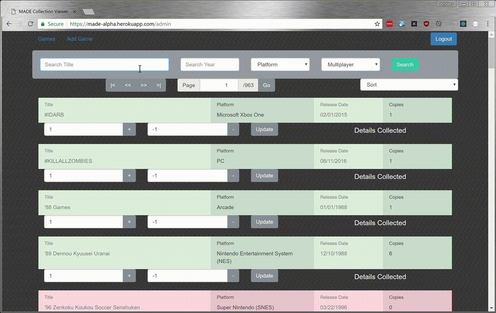

# MADE Collection Viewer
>Inventory system for the made with a frontend allowing visitors to view the MADE's collection of artifacts. Built in Node.js with a React frontend. 
## Install
```
yarn installDeps
```
## Seed
> To seed a list of games from [thegamesDB.net](http://www.thegamesDB.net)
```
yarn seed
```
>To seed just platforms from [thegamesDB.net](http://www.thegamesDB.net)
```
yarn seed-platforms
```
>To seed the list of games from [thegamesDB.net](http://www.thegamesDB.net) (requires platforms having been seeded)
```
yarn seed-list
```
>To seed details on the games from [thegamesDB.net](http://www.thegamesDB.net) (requeires list of games having been seeded)
```
yarn seed-details
```
## Usage
>Public Viewing of Games


>Public Search of Games


>Admin adding games to collection


>Admin Search of Games



>Admin update game page


## Dependencies
* [React](https://reactjs.org/)
* [Axios](https://www.npmjs.com/package/axios)
* [Express](https://expressjs.com/)
* [Mongoose](http://mongoosejs.com/)
* [request](https://www.npmjs.com/package/request)
* [body-parser](https://www.npmjs.com/package/body-parser)
* [passport](http://www.passportjs.org/)
* [moment](http://momentjs.com/)
* [xml2js](https://www.npmjs.com/package/xml2js)
* [reactstrap](http://reactstrap.github.io/)

